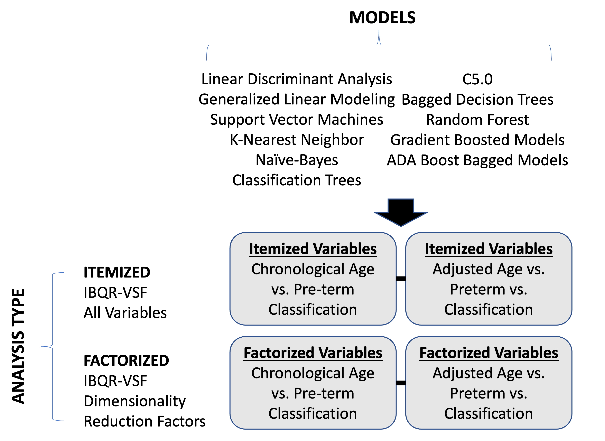
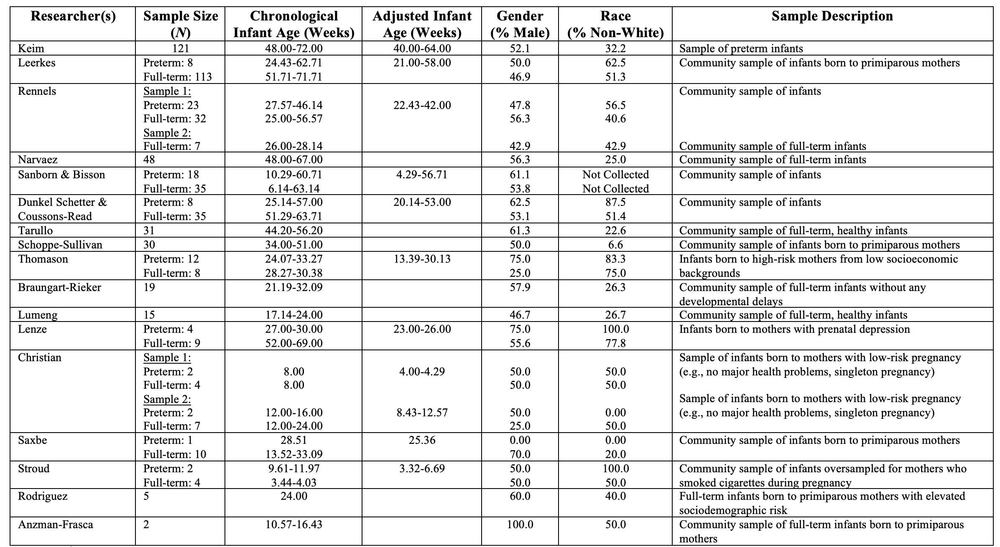

```{r setup, include=FALSE}
knitr::opts_chunk$set(echo = TRUE, fig.align = "center", fig.width=16, fig.height=8.5, dpi=400, dev = "cairo_pdf")
knitr::opts_knit$set(root.dir = "/mnt/ceph/erichs/git/IBQ_R_2022/", warning = FALSE, message = FALSE)  # with something else than `getwd()`

usePackage <- function(p) {
    if (!is.element(p, installed.packages()[,1]))
        install.packages(p, dep = TRUE, repos = "http://cran.us.r-project.org")
    require(p, character.only = TRUE)
}
usePackage("extrafont")
usePackage("ggplot2")
usePackage("webshot")
#webshot::install_phantomjs()
loadfonts()
```

This supplemental appendix provides machine learning analyses, figures and tables in support of the following manuscript: "Leveraging Machine Learning to Study How Temperament Scores Predict Pre-Term Birth Status", submitted to Early Human Development.

\newpage 
<!-- \tableofcontents # adds table of contents -->
\listoffigures
\listoftables
\newpage


```{r, results='hide', echo=FALSE, warning = FALSE, message = FALSE, error=FALSE, fig.width = 10.5, fig.height = 7.5}

library(dplyr)
library(lubridate)
library(tidyr)
library(data.table)
library(caret)
library(doParallel)
library(plyr)
library(mice)
library(VIM)

#ibq <- read.csv("./data/IBQ-R VSF Preterm 91022.csv")

set.seed(999)
ibq <- read.csv("./data/IBQ-R VSF Preterms Sept23.csv")
ibq[ibq == -99999] <- NA
ibq[ibq == 100] <- NA

#ibq[8:45] <- lapply(ibq[8:45], factor)  ## as.factor() could also be used

#ibq_mice <- md.pattern(ibq[8:45])
#aggr_plot <- aggr(ibq[8:45], col=c('navyblue','red'), numbers=TRUE, sortVars=TRUE, labels=names(ibq[8:45]), cex.axis=.7, gap=3, ylab=c("Histogram of missing data","Pattern"))

tempData <- mice(ibq[8:44],m=5,maxit=5,meth='pmm',seed=500)
ibq_impute <- complete(tempData,5)

ibq_impute <- cbind(ibq[1:7], ibq_impute, ibq[46:48])

ibq_impute$na <- rowMeans(ibq_impute[c(10,11,16,17,23,24,29,30,35,36,39,40)])
ibq_impute$sur <- rowMeans(ibq_impute[c(8,9,14,15,20,21,22,27,28,33,34,43,44)])
ibq_impute$ec <- rowMeans(ibq_impute[c(12,13,18,19,25,26,31,32,37,38,41,42)])

```
\newpage

```{r figure1, echo = FALSE, message=FALSE, fig.align='center', fig.cap=paste("Modeling Methodology."), out.width='0.75\\linewidth', fig.pos='H'}

```
\newpage

```{r, echo=FALSE, warning=FALSE, message=FALSE}


library(kableExtra)
library(gridExtra)

questions <- c("Item 1: When being dressed or undressed during the last week, how often did the baby squirm and/or try to roll away?", "Item 2: When tossed around playfully how often did the baby laugh?", "Item 3: When tired, how often did your baby show distress?", "Item 4: When introduced to an unfamiliar adult, how often did the baby cling to a parent?", "Item 5: How often during the last week did the baby enjoy being read to?", "Item 6: How often during the last week did the baby play with one toy or object for 5-10 minutes?", "Item 7: How often during the week did your baby move quickly toward new objects?", "Item 8: When put into the bath water, how often did the baby laugh?", "Item 9: When it was time for bed or a nap and your baby did not want to go, how often did s/he whimper or sob?", "Item 10: After sleeping, how often did the baby cry if someone doesn’t come within a few minutes?", "Item 11: In the last week, while being fed in your lap, how often did the baby seem eager to get away as soon as the feeding was over?", "Item 12: When singing or talking to your baby, how often did s/he soothe immediately?", "Item 13: When placed on his/her back, how often did the baby squirm and/or turn body?", "Item 14: During a peekaboo game, how often did the baby laugh?", "Item 15: How often does the infant look up from playing when the telephone rings?", "Item 16: How often did the baby seem angry (crying and fussing) when you left her/him in the crib?", "Item 17: How often during the last week did the baby startle at a sudden change in body position (e.g., when moved suddenly)?", "Item 18: How often during the last week did the baby enjoy hearing the sound of words, as in nursery rhymes?", "Item 19: How often during the last week did the baby look at pictures in books and/or magazines for 5 minutes or longer at a time?", "Item 20: When visiting a new place, how often did your baby get excited about exploring new surroundings?", "Item 21: How often during the last week did the baby smile or laugh when given a toy?", "Item 22: At the end of an exciting day, how often did your baby become tearful?", "Item 23: How often during the last week did the baby protest being placed in a confining place (infant seat, play pen, car seat, etc.)?", "Item 24: When being held, in the last week, did your baby seem to enjoy him/herself?", "Item 25: When showing the baby something to look at, how often did s/he soothe immediately?", "Item 26: When hair was washed, how often did the baby vocalize?", "Item 27: How often did your baby notice the sound of an airplane passing overhead?", "Item 28: When introduced to an unfamiliar adult, how often did the baby refuse to go to the unfamiliar person?", "Item 29: When you were busy with another activity, and your baby was not able to get your attention, how often did s/he cry?", "Item 30: How often during the last week did the baby enjoy gentle rhythmic activities, such as rocking or swaying?", "Item 31: How often during the last week did the baby stare at a mobile, crib bumper or picture for 5 minutes or longer?", "Item 32: When the baby wanted something, how often did s/he become upset when s/he could not get what s/he wanted?", "Item 33: When in the presence of several unfamiliar adults, how often did the baby cling to a parent?", "Item 34: When rocked or hugged, in the last week, did your baby seem to enjoy him/herself?", "Item 35: When patting or gently rubbing some part of the baby’s body, how often did s/he soothe immediately?", "Item 36: How often did your baby make talking sounds when riding in a car?", "Item 37: When placed in an infant seat or car seat, how often did the baby squirm and turn body?")

Surgency <- as.data.frame(questions[c(1,2,7,8,13,14,15,20,21,26,27,36,37)])
colnames(Surgency) <- "Surgency"
Negative_Affect <- as.data.frame(questions[c(3,4,9,10,16,17,22,23,28,29,32,33)])
colnames(Negative_Affect) <- "Negative Affect"
Effortful_Control <- as.data.frame(questions[c(5,6,11,12,18,19,24,25,30,31,34,35)])
colnames(Effortful_Control) <- "Effortful Control"

kable(Surgency, caption = "Infant Behavior Questionnaire-Revised Very Short Form Items - Surgency") %>%
kable_styling(position = "left", font_size = 8) %>% row_spec(0,bold=TRUE) %>%
  column_spec(1, width = "60em")

kable(Negative_Affect, caption = "Infant Behavior Questionnaire-Revised Very Short Form Items - Negative Affect") %>%
kable_styling(position = "left", font_size = 8) %>% row_spec(0,bold=TRUE) %>%
  column_spec(1, width = "60em")

kable(Effortful_Control, caption = "Infant Behavior Questionnaire-Revised Very Short Form Items - Effortful Control") %>%
kable_styling(position = "left", font_size = 8) %>% row_spec(0,bold=TRUE) %>%
  column_spec(1, width = "60em")


```


\newpage
\blandscape

```{r table2, echo = FALSE, message=FALSE, fig.env='table', fig.topcaption=TRUE, fig.align='center', fig.cap=paste("Sample Descriptions."), out.width='1\\linewidth', fig.pos='H'}

```

\elandscape
\newpage

```{r, echo=FALSE, warning = FALSE, message = FALSE, error=FALSE, fig.width = 11, fig.height = 7.5, fig.cap=paste("Accuracy Estimates: Chronological Age Group vs. Pre-Term Group - Itemized Variables.")}

set.seed(9999)
library(haven)
library(klaR)
#Infant gender model construction

ibq <- ibq_impute

ibq$group <- as.factor(ibq$group)
ibq$group <- revalue(ibq$group, c("0"="experimental", "1"="control_one", "2"="control_two"))

ibq <- ibq[ibq$group != "control_two",]
ibq$group <- factor(ibq$group)
ibq$group <- relevel(ibq$group, "control_one")

#ibq <- subset(ibq, AgeGrp == "three")

# ibq$infantgender <- as.factor(ibq$infantgender)
# levels(ibq$infantgender) <- c('male', 'female')

set.seed(103)
inTraining <- createDataPartition(ibq$group, p = .7, list = FALSE)
training <- ibq[ inTraining,]
testing  <- ibq[-inTraining,]

fmla <- as.formula(paste("group ~ ", paste(colnames(ibq[c(8:44)]), collapse= "+")))
predictors <- colnames(ibq[c(8:44)])

train_control<- trainControl(method="repeatedcv", savePredictions = "final", classProbs = T, returnResamp='all')

cl <- makePSOCKcluster(10)
registerDoParallel(cl)

fit_rf_control_one_all <- caret::train(fmla, data=training, method="rf", trControl = train_control, importance = TRUE)
fit_lda_control_one_all <- caret::train(fmla, data=training, method="lda", trControl = train_control)
fit_glm_control_one_all <- caret::train(fmla, data=training, method="glm", trControl = train_control)
fit_knn_control_one_all <- caret::train(fmla, data=training, method="knn",trControl = train_control)
fit_nb_control_one_all <- caret::train(fmla, data=training, method="nb", trControl = train_control)
fit_svm_control_one_all <- caret::train(fmla, data=training, method="svmRadial", trControl = train_control)
fit_cart_control_one_all <- caret::train(fmla, data=training, method="rpart", trControl = train_control)
fit_c50_control_one_all <- caret::train(fmla, data=training, method="C5.0", trControl = train_control)
fit_treebag_control_one_all <- caret::train(fmla, data=training, method="treebag", trControl = train_control)
fit_gbm_control_one_all <- caret::train(fmla, data=training, method="gbm", trControl = train_control, verbose = FALSE)
fit_adabag_control_one_all <- caret::train(fmla, data=training, method="AdaBag", trControl = train_control)

## When you are done:
stopCluster(cl)


#infant gender model results

results <- resamples(list(lda=fit_lda_control_one_all, glm=fit_glm_control_one_all, svm=fit_svm_control_one_all, knn=fit_knn_control_one_all, nb=fit_nb_control_one_all, cart=fit_cart_control_one_all, c50=fit_c50_control_one_all,treebag=fit_treebag_control_one_all, rf=fit_rf_control_one_all, gbm=fit_gbm_control_one_all, adabag=fit_adabag_control_one_all))
# Table comparison
#summary(results)

# boxplot comparison
bwplot(results)
# Dot-plot comparison
#dotplot(results)


```

\newpage

```{r, echo=FALSE, warning = FALSE, message = FALSE, error=FALSE, fig.align = "center", fig.width = 11, fig.height = 7.5, fig.cap=paste("Receiver Operator Curve: Chronological Age Group vs. Pre-Term Group - Itemized Variables.")}
set.seed(9999)

modellist <- c("lda", "glm", "svm", "knn", "nb", "cart",  "treebag", "rf", "gbm", "adabag")
leng <- 1:length(modellist)  
txt <- NULL
txt2 <- NULL
j <- 1
for (i in modellist) {
  modelnumber <- leng[j]
  library("ROCR")
  ### CONSTRUCTING ROC AUC PLOT:
  # Get the posteriors as a dataframe.
  predictions <-predict(object = eval(parse(text=paste("fit_", i, "_control_one_all", sep=""))), testing[,predictors], type = "prob")
  predictions.posteriors <- as.data.frame(predictions)
  
  # Evaluate the model
  pred <- prediction(predictions.posteriors[,2], testing[,3])
  roc.perf = performance(pred, measure = "tpr", x.measure = "fpr")
  roc.recall = performance(pred, measure = "prec", x.measure = "rec")
  auc.train <- performance(pred, measure = "auc")
  auc.train <- auc.train@y.values
  # Plot
  
  par(mar=c(5.1, 4.1, 4.1, 13), xpd=TRUE) 
  
  if(modelnumber == 1) {
    plot(roc.perf, col = j,  cex.lab = 1.5, cex.main = 1.5)  
    #abline(a=0, b= 1)
    #text(x = .25, y = .65 ,paste("AUC = ", round(auc.train[[1]],3), sep = ""))
  } else{
    plot(roc.perf, col = j, add = TRUE, cex.lab = 1.5, cex.main = 1.5)
    #abline(a=0, b= 1)
    
  }
  
  
  txt[j] <- paste(i, " AUC = ", round(auc.train[[1]],3), sep = "")
  txt2[j] <- round(auc.train[[1]],3)
  j <- j+1
  
}

legend("bottomright", txt, inset=c(0,0), lty = 1, col = c(1:11), cex = 1.1, xpd=TRUE )

#--recall plot
# 
# modellist <- c("lda", "glm", "svm", "knn", "nb", "cart",  "treebag", "rf", "gbm", "adabag")
# leng <- 1:length(modellist)  
# txt <- NULL
# txt2 <- NULL
# j <- 1
# for (i in modellist) {
#   modelnumber <- leng[j]
#   library("ROCR")
#   ### CONSTRUCTING ROC AUC PLOT:
#   # Get the posteriors as a dataframe.
#   predictions <-predict(object = eval(parse(text=paste("fit_", i, "_control_one_all", sep=""))), testing[,predictors], type = "prob")
#   predictions.posteriors <- as.data.frame(predictions)
#   
#   # Evaluate the model
#   pred <- prediction(predictions.posteriors[,2], testing[,3])
#   roc.perf = performance(pred, measure = "tpr", x.measure = "fpr")
#   roc.recall = performance(pred, measure = "prec", x.measure = "rec")
#   auc.train <- performance(pred, measure = "auc")
#   auc.train <- auc.train@y.values
#   auc.recall.train <- performance(pred, measure = "aucpr")
#   auc.recall.train <- auc.recall.train@y.values
# 
#   # Plot
#   
# #--recall plot
# 
# 
# 
#   par(mar=c(5.1, 4.1, 4.1, 13), xpd=TRUE) 
#   
#   if(modelnumber == 1) {
#     plot(roc.recall, avg = "threshold", col = j, cex.lab = 1.5, cex.main = 1.5, ylim=c(.4,1))
#     #abline(a=0, b= 1)
#     #text(x = .25, y = .65 ,paste("AUC = ", round(auc.train[[1]],3), sep = ""))
#   } else{
#     plot(roc.recall, avg = "threshold", col = j, add = TRUE, cex.lab = 1.5, cex.main = 1.5, ylim=c(.4,1)) 
#     #abline(a=0, b= 1)
#     
#   }
#   
#   
#   txt[j] <- paste(i, " PR AUC = ", round(auc.recall.train[[1]],3), sep = "")
#   txt2[j] <- round(auc.recall.train[[1]],3)
#   j <- j+1
#   
# }
# 
# legend("topright", txt, inset=c(0,0), lty = 1, col = c(1:11), cex = 1.1, xpd=TRUE )
# 


results_one_all <- results
auc_one_all <- txt2

```

\newpage

```{r, echo=FALSE, warning = FALSE, message = FALSE, error=FALSE, fig.width = 11, fig.height = 7.5, fig.cap=paste("Accuracy Estimates: Age Adjusted Group vs. Pre-Term Group - Itemized Variables.")}
set.seed(9999)
library(haven)
library(klaR)
#Infant gender model construction

ibq <- ibq_impute

ibq$group <- as.factor(ibq$group)
ibq$group <- revalue(ibq$group, c("0"="experimental", "1"="control_one", "2"="control_two"))

ibq <- ibq[ibq$group != "control_one",]
ibq$group <- factor(ibq$group)
ibq$group <- relevel(ibq$group, "control_two")

#ibq <- subset(ibq, AgeGrp == "three")

# ibq$infantgender <- as.factor(ibq$infantgender)
# levels(ibq$infantgender) <- c('male', 'female')

set.seed(103)
inTraining <- createDataPartition(ibq$group, p = .7, list = FALSE)
training <- ibq[ inTraining,]
testing  <- ibq[-inTraining,]

fmla <- as.formula(paste("group ~ ", paste(colnames(ibq[c(8:44)]), collapse= "+")))
predictors <- colnames(ibq[c(8:44)])

train_control<- trainControl(method="repeatedcv", savePredictions = "final", classProbs = T, returnResamp='all')

cl <- makePSOCKcluster(10)
registerDoParallel(cl)

fit_rf_control_two_all <- caret::train(fmla, data=training, method="rf", trControl = train_control, importance = TRUE)
fit_lda_control_two_all <- caret::train(fmla, data=training, method="lda", trControl = train_control)
fit_glm_control_two_all <- caret::train(fmla, data=training, method="glm", trControl = train_control)
fit_knn_control_two_all <- caret::train(fmla, data=training, method="knn",trControl = train_control)
fit_nb_control_two_all <- caret::train(fmla, data=training, method="nb", trControl = train_control)
fit_svm_control_two_all <- caret::train(fmla, data=training, method="svmRadial", trControl = train_control)
fit_cart_control_two_all <- caret::train(fmla, data=training, method="rpart", trControl = train_control)
fit_c50_control_two_all <- caret::train(fmla, data=training, method="C5.0", trControl = train_control)
fit_treebag_control_two_all <- caret::train(fmla, data=training, method="treebag", trControl = train_control)
fit_gbm_control_two_all <- caret::train(fmla, data=training, method="gbm", trControl = train_control, verbose = FALSE)
fit_adabag_control_two_all <- caret::train(fmla, data=training, method="AdaBag", trControl = train_control)

## When you are done:
stopCluster(cl)


#infant gender model results

results <- resamples(list(lda=fit_lda_control_two_all, glm=fit_glm_control_two_all, svm=fit_svm_control_two_all, knn=fit_knn_control_two_all, nb=fit_nb_control_two_all, cart=fit_cart_control_two_all, c50=fit_c50_control_two_all,treebag=fit_treebag_control_two_all, rf=fit_rf_control_two_all, gbm=fit_gbm_control_two_all, adabag=fit_adabag_control_two_all))
# Table comparison
#summary(results)

# boxplot comparison
bwplot(results)
# Dot-plot comparison
#dotplot(results)


```

\newpage

```{r, echo=FALSE, warning = FALSE, message = FALSE, error=FALSE, fig.width = 11, fig.height = 7.5, fig.cap=paste("Receiver Operator Curve: Age Adjusted Group vs. Pre-Term Group - Itemized Variables.")}
set.seed(9999)

modellist <- c("lda", "glm", "svm", "knn", "nb", "cart",  "treebag", "rf", "gbm", "adabag")
leng <- 1:length(modellist)  
txt <- NULL
txt2 <- NULL
j <- 1
for (i in modellist) {
  modelnumber <- leng[j]
  library("ROCR")
  ### CONSTRUCTING ROC AUC PLOT:
  # Get the posteriors as a dataframe.
  predictions <-predict(object = eval(parse(text=paste("fit_", i, "_control_two_all", sep=""))), testing[,predictors], type = "prob")
  predictions.posteriors <- as.data.frame(predictions)
  
  # Evaluate the model
  pred <- prediction(predictions.posteriors[,2], testing[,3])
  roc.perf = performance(pred, measure = "tpr", x.measure = "fpr")
  auc.train <- performance(pred, measure = "auc")
  auc.train <- auc.train@y.values
  # Plot
  
  par(mar=c(5.1, 4.1, 4.1, 13), xpd=TRUE) 
  
  if(modelnumber == 1) {
    plot(roc.perf, col = j, cex.lab = 1.5, cex.main = 1.5)  
    #abline(a=0, b= 1)
    #text(x = .25, y = .65 ,paste("AUC = ", round(auc.train[[1]],3), sep = ""))
  } else{
    plot(roc.perf, col = j, add = TRUE, cex.lab = 1.5, cex.main = 1.5)
    #abline(a=0, b= 1)
    
  }
  txt[j] <- paste(i, " AUC = ", round(auc.train[[1]],3), sep = "")
  txt2[j] <- round(auc.train[[1]],3)
  j <- j+1
  
}

legend("bottomright", txt, inset=c(0,0), lty = 1, col = c(1:11), cex = 1.1, xpd=TRUE )

#recall
# 
# modellist <- c("lda", "glm", "svm", "knn", "nb", "cart",  "treebag", "rf", "gbm", "adabag")
# leng <- 1:length(modellist)  
# txt <- NULL
# txt2 <- NULL
# j <- 1
# for (i in modellist) {
#   modelnumber <- leng[j]
#   library("ROCR")
#   ### CONSTRUCTING ROC AUC PLOT:
#   # Get the posteriors as a dataframe.
#   predictions <-predict(object = eval(parse(text=paste("fit_", i, "_control_two_all", sep=""))), testing[,predictors], type = "prob")
#   predictions.posteriors <- as.data.frame(predictions)
#   
#   # Evaluate the model
#   pred <- prediction(predictions.posteriors[,2], testing[,3])
#   roc.perf = performance(pred, measure = "tpr", x.measure = "fpr")
#   roc.recall = performance(pred, measure = "prec", x.measure = "rec")
#   auc.train <- performance(pred, measure = "auc")
#   auc.train <- auc.train@y.values
#   auc.recall.train <- performance(pred, measure = "aucpr")
#   auc.recall.train <- auc.recall.train@y.values
# 
#   # Plot
#   
# #--recall plot
# 
# 
# 
#   par(mar=c(5.1, 4.1, 4.1, 13), xpd=TRUE) 
#   
#   if(modelnumber == 1) {
#     plot(roc.recall, avg = "threshold", col = j, cex.lab = 1.5, cex.main = 1.5, ylim=c(.4, 1))
#     #abline(a=0, b= 1)
#     #text(x = .25, y = .65 ,paste("AUC = ", round(auc.train[[1]],3), sep = ""))
#   } else{
#     plot(roc.recall, avg = "threshold", col = j, add = TRUE, cex.lab = 1.5, cex.main = 1.5, ylim=c(.4, 1) )
#     #abline(a=0, b= 1)
#     
#   }
#   
#   
#   txt[j] <- paste(i, " PR AUC = ", round(auc.recall.train[[1]],3), sep = "")
#   txt2[j] <- round(auc.recall.train[[1]],3)
#   j <- j+1
#   
# }
# 
# legend("topright", txt, inset=c(0,0), lty = 1, col = c(1:11), cex = 1.1, xpd=TRUE )

results_two_all <- results
auc_two_all <- txt2

```

\newpage


```{r, echo=FALSE, warning = FALSE, results = 'hide', message = FALSE, error=FALSE, fig.width = 11, fig.height = 7.5, fig.cap=paste("Accuracy Estimates: Chronological Age Group vs. Pre-Term Group - Factorized Variables.")}
set.seed(9999)
library(haven)
library(klaR)
#Infant gender model construction

ibq <- ibq_impute

ibq$group <- as.factor(ibq$group)
ibq$group <- revalue(ibq$group, c("0"="experimental", "1"="control_one", "2"="control_two"))

ibq <- ibq[ibq$group != "control_two",]
ibq$group <- factor(ibq$group)
ibq$group <- relevel(ibq$group, "control_one")
#ibq <- subset(ibq, AgeGrp == "three")

# ibq$infantgender <- as.factor(ibq$infantgender)
# levels(ibq$infantgender) <- c('male', 'female')

set.seed(103)
inTraining <- createDataPartition(ibq$group, p = .7, list = FALSE)
training <- ibq[ inTraining,]
testing  <- ibq[-inTraining,]

fmla <- as.formula(paste("group ~ ", paste(colnames(ibq[c(45:47)]), collapse= "+")))
predictors <- colnames(ibq[c(45:47)])

train_control<- trainControl(method="repeatedcv", savePredictions = "final", classProbs = T, returnResamp='all')

cl <- makePSOCKcluster(10)
registerDoParallel(cl)

fit_rf_control_one_trans <- caret::train(fmla, data=training, method="rf", trControl = train_control, importance = TRUE)
fit_lda_control_one_trans <- caret::train(fmla, data=training, method="lda", trControl = train_control)
fit_glm_control_one_trans <- caret::train(fmla, data=training, method="glm", trControl = train_control)
fit_knn_control_one_trans <- caret::train(fmla, data=training, method="knn",trControl = train_control)
fit_nb_control_one_trans <- caret::train(fmla, data=training, method="nb", trControl = train_control)
fit_svm_control_one_trans <- caret::train(fmla, data=training, method="svmRadial", trControl = train_control)
fit_cart_control_one_trans <- caret::train(fmla, data=training, method="rpart", trControl = train_control)
fit_c50_control_one_trans <- caret::train(fmla, data=training, method="C5.0", trControl = train_control)
fit_treebag_control_one_trans <- caret::train(fmla, data=training, method="treebag", trControl = train_control)
fit_gbm_control_one_trans <- caret::train(fmla, data=training, method="gbm", trControl = train_control, verbose = FALSE)
fit_adabag_control_one_trans <- caret::train(fmla, data=training, method="AdaBag", trControl = train_control)

## When you are done:
stopCluster(cl)


#infant gender model results

results <- resamples(list(lda=fit_lda_control_one_trans, glm=fit_glm_control_one_trans, svm=fit_svm_control_one_trans, knn=fit_knn_control_one_trans, nb=fit_nb_control_one_trans, cart=fit_cart_control_one_trans, c50=fit_c50_control_one_trans,treebag=fit_treebag_control_one_trans, rf=fit_rf_control_one_trans, gbm=fit_gbm_control_one_trans, adabag=fit_adabag_control_one_trans))
# Table comparison
#summary(results)

# boxplot comparison
bwplot(results)
# Dot-plot comparison
#dotplot(results)


```

\newpage

```{r, echo=FALSE, warning = FALSE, message = FALSE, error=FALSE, fig.width = 11, fig.height = 7.5, fig.cap=paste("Receiver Operator Curve: Chronological Age Group vs. Pre-Term Group - Factorized Variables.")}
set.seed(9999)

modellist <- c("lda", "glm", "svm", "knn", "nb", "cart",  "treebag", "rf", "gbm", "adabag")
leng <- 1:length(modellist)  
txt <- NULL
txt2 <- NULL
j <- 1
for (i in modellist) {
  modelnumber <- leng[j]
  library("ROCR")
  ### CONSTRUCTING ROC AUC PLOT:
  # Get the posteriors as a dataframe.
  predictions <-predict(object = eval(parse(text=paste("fit_", i, "_control_one_trans", sep=""))), testing[,predictors], type = "prob")
  predictions.posteriors <- as.data.frame(predictions)
  
  # Evaluate the model
  pred <- prediction(predictions.posteriors[,2], testing[,3])
  roc.perf = performance(pred, measure = "tpr", x.measure = "fpr")
  auc.train <- performance(pred, measure = "auc")
  auc.train <- auc.train@y.values
  # Plot
  
  par(mar=c(5.1, 4.1, 4.1, 13), xpd=TRUE) 
  
  if(modelnumber == 1) {
    plot(roc.perf, col = j, cex.lab = 1.5, cex.main = 1.5)  
    #abline(a=0, b= 1)
    #text(x = .25, y = .65 ,paste("AUC = ", round(auc.train[[1]],3), sep = ""))
  } else{
    plot(roc.perf, col = j, add = TRUE, cex.lab = 1.5, cex.main = 1.5)
    #abline(a=0, b= 1)
    
  }
  txt[j] <- paste(i, " AUC = ", round(auc.train[[1]],3), sep = "")
  txt2[j] <- round(auc.train[[1]],3)
  j <- j+1
  
}

legend("bottomright", txt, inset=c(0,0), lty = 1, col = c(1:11), cex = 1.1, xpd=TRUE )

#recall
# 
# modellist <- c("lda", "glm", "svm", "knn", "nb", "cart",  "treebag", "rf", "gbm", "adabag")
# leng <- 1:length(modellist)  
# txt <- NULL
# txt2 <- NULL
# j <- 1
# for (i in modellist) {
#   modelnumber <- leng[j]
#   library("ROCR")
#   ### CONSTRUCTING ROC AUC PLOT:
#   # Get the posteriors as a dataframe.
#   predictions <-predict(object = eval(parse(text=paste("fit_", i, "_control_one_trans", sep=""))), testing[,predictors], type = "prob")
#   predictions.posteriors <- as.data.frame(predictions)
#   
#   # Evaluate the model
#   pred <- prediction(predictions.posteriors[,2], testing[,3])
#   roc.perf = performance(pred, measure = "tpr", x.measure = "fpr")
#   roc.recall = performance(pred, measure = "prec", x.measure = "rec")
#   auc.train <- performance(pred, measure = "auc")
#   auc.train <- auc.train@y.values
#   auc.recall.train <- performance(pred, measure = "aucpr")
#   auc.recall.train <- auc.recall.train@y.values
# 
#   # Plot
#   
# #--recall plot
# 
# 
# 
#   par(mar=c(5.1, 4.1, 4.1, 13), xpd=TRUE) 
#   
#   if(modelnumber == 1) {
#     plot(roc.recall, avg = "threshold", col = j, cex.lab = 1.5, cex.main = 1.5, ylim=c(0,1))
#     #abline(a=0, b= 1)
#     #text(x = .25, y = .65 ,paste("AUC = ", round(auc.train[[1]],3), sep = ""))
#   } else{
#     plot(roc.recall, avg = "threshold", col = j, add = TRUE, cex.lab = 1.5, cex.main = 1.5, ylim=c(0,1) )
#     #abline(a=0, b= 1)
#     
#   }
#   
#   
#   txt[j] <- paste(i, " PR AUC = ", round(auc.recall.train[[1]],3), sep = "")
#   txt2[j] <- round(auc.recall.train[[1]],3)
#   j <- j+1
#   
# }
# 
# legend("topright", txt, inset=c(0,0), lty = 1, col = c(1:11), cex = 1.1, xpd=TRUE )


results_one_trans <- results
auc_one_trans <- txt2

```

\newpage

```{r, echo=FALSE, results = 'hide', warning = FALSE, message = FALSE, error=FALSE, fig.width = 11, fig.height = 7.5, fig.cap=paste("Accuracy Estimates: Age Adjusted Group vs. Pre-Term Group - Factorized Variables.")}
set.seed(9999)
library(haven)
library(klaR)
#Infant gender model construction

ibq <- ibq_impute

ibq$group <- as.factor(ibq$group)
ibq$group <- revalue(ibq$group, c("0"="experimental", "1"="control_one", "2"="control_two"))

ibq <- ibq[ibq$group != "control_one",]
ibq$group <- factor(ibq$group)
ibq$group <- relevel(ibq$group, "control_two")

#ibq <- subset(ibq, AgeGrp == "three")

# ibq$infantgender <- as.factor(ibq$infantgender)
# levels(ibq$infantgender) <- c('male', 'female')

set.seed(103)
inTraining <- createDataPartition(ibq$group, p = .7, list = FALSE)
training <- ibq[ inTraining,]
testing  <- ibq[-inTraining,]

fmla <- as.formula(paste("group ~ ", paste(colnames(ibq[c(45:47)]), collapse= "+")))
predictors <- colnames(ibq[c(45:47)])

train_control<- trainControl(method="repeatedcv", savePredictions = "final", classProbs = T, returnResamp='all')

cl <- makePSOCKcluster(10)
registerDoParallel(cl)

fit_rf_control_two_trans <- caret::train(fmla, data=training, method="rf", trControl = train_control, importance = TRUE)
fit_lda_control_two_trans <- caret::train(fmla, data=training, method="lda", trControl = train_control)
fit_glm_control_two_trans <- caret::train(fmla, data=training, method="glm", trControl = train_control)
fit_knn_control_two_trans <- caret::train(fmla, data=training, method="knn",trControl = train_control)
fit_nb_control_two_trans <- caret::train(fmla, data=training, method="nb", trControl = train_control)
fit_svm_control_two_trans <- caret::train(fmla, data=training, method="svmRadial", trControl = train_control)
fit_cart_control_two_trans <- caret::train(fmla, data=training, method="rpart", trControl = train_control)
fit_c50_control_two_trans <- caret::train(fmla, data=training, method="C5.0", trControl = train_control)
fit_treebag_control_two_trans <- caret::train(fmla, data=training, method="treebag", trControl = train_control)
fit_gbm_control_two_trans <- caret::train(fmla, data=training, method="gbm", trControl = train_control, verbose = FALSE)
fit_adabag_control_two_trans <- caret::train(fmla, data=training, method="AdaBag", trControl = train_control)

## When you are done:
stopCluster(cl)


#infant gender model results

results <- resamples(list(lda=fit_lda_control_two_trans, glm=fit_glm_control_two_trans, svm=fit_svm_control_two_trans, knn=fit_knn_control_two_trans, nb=fit_nb_control_two_trans, cart=fit_cart_control_two_trans, c50=fit_c50_control_two_trans,treebag=fit_treebag_control_two_trans, rf=fit_rf_control_two_trans, gbm=fit_gbm_control_two_trans, adabag=fit_adabag_control_two_trans))
# Table comparison
#summary(results)

# boxplot comparison
bwplot(results)
# Dot-plot comparison
#dotplot(results)


```


\newpage

```{r, echo=FALSE, warning = FALSE, message = FALSE, error=FALSE, fig.width = 11, fig.height = 7.5, fig.cap=paste("Receiver Operator Curve: Age Adjusted Group vs. Pre-Term Group - Factorized Variables.")}
set.seed(9999)

modellist <- c("lda", "glm", "svm", "knn", "nb", "cart",  "treebag", "rf", "gbm", "adabag")
leng <- 1:length(modellist)  
txt <- NULL
txt2 <- NULL
j <- 1
for (i in modellist) {
  modelnumber <- leng[j]
  library("ROCR")
  ### CONSTRUCTING ROC AUC PLOT:
  # Get the posteriors as a dataframe.
  predictions <-predict(object = eval(parse(text=paste("fit_", i, "_control_two_trans", sep=""))), testing[,predictors], type = "prob")
  predictions.posteriors <- as.data.frame(predictions)
  
  # Evaluate the model
  pred <- prediction(predictions.posteriors[,2], testing[,3])
  roc.perf = performance(pred, measure = "tpr", x.measure = "fpr")
  auc.train <- performance(pred, measure = "auc")
  auc.train <- auc.train@y.values
  # Plot
  
  par(mar=c(5.1, 4.1, 4.1, 13), xpd=TRUE) 
  
  if(modelnumber == 1) {
    plot(roc.perf, col = j, cex.lab = 1.5, cex.main = 1.5)  
    #abline(a=0, b= 1)
    #text(x = .25, y = .65 ,paste("AUC = ", round(auc.train[[1]],3), sep = ""))
  } else{
    plot(roc.perf, col = j, add = TRUE, cex.lab = 1.5, cex.main = 1.5)
    #abline(a=0, b= 1)
    
  }
  txt[j] <- paste(i, " AUC = ", round(auc.train[[1]],3), sep = "")
  txt2[j] <- round(auc.train[[1]],3)
  j <- j+1
  
}

legend("bottomright", txt, inset=c(0,0), lty = 1, col = c(1:11), cex = 1.1, xpd=TRUE )

#recall
# 
# modellist <- c("lda", "glm", "svm", "knn", "nb", "cart",  "treebag", "rf", "gbm", "adabag")
# leng <- 1:length(modellist)  
# txt <- NULL
# txt2 <- NULL
# j <- 1
# for (i in modellist) {
#   modelnumber <- leng[j]
#   library("ROCR")
#   ### CONSTRUCTING ROC AUC PLOT:
#   # Get the posteriors as a dataframe.
#   predictions <-predict(object = eval(parse(text=paste("fit_", i, "_control_two_trans", sep=""))), testing[,predictors], type = "prob")
#   predictions.posteriors <- as.data.frame(predictions)
#   
#   # Evaluate the model
#   pred <- prediction(predictions.posteriors[,2], testing[,3])
#   roc.perf = performance(pred, measure = "tpr", x.measure = "fpr")
#   roc.recall = performance(pred, measure = "prec", x.measure = "rec")
#   auc.train <- performance(pred, measure = "auc")
#   auc.train <- auc.train@y.values
#   auc.recall.train <- performance(pred, measure = "aucpr")
#   auc.recall.train <- auc.recall.train@y.values
# 
#   # Plot
#   
# #--recall plot
# 
# 
# 
#   par(mar=c(5.1, 4.1, 4.1, 13), xpd=TRUE) 
#   
#   if(modelnumber == 1) {
#     plot(roc.recall, avg = "threshold", col = j, cex.lab = 1.5, cex.main = 1.5, ylim=c(.3,1))
#     #abline(a=0, b= 1)
#     #text(x = .25, y = .65 ,paste("AUC = ", round(auc.train[[1]],3), sep = ""))
#   } else{
#     plot(roc.recall, avg = "threshold", col = j, add = TRUE, cex.lab = 1.5, cex.main = 1.5, ylim=c(.3,1) )
#     #abline(a=0, b= 1)
#     
#   }
#   
#   
#   txt[j] <- paste(i, " PR AUC = ", round(auc.recall.train[[1]],3), sep = "")
#   txt2[j] <- round(auc.recall.train[[1]],3)
#   j <- j+1
#   
# }
# 
# legend("topright", txt, inset=c(0,0), lty = 1, col = c(1:11), cex = 1.1, xpd=TRUE )


results_two_trans <- results
auc_two_trans <- txt2

```

\newpage


```{r, echo=FALSE, warning=FALSE, message=FALSE, fig.width = 10.5, fig.height = 7.5, fig.cap=paste("Feature Importance: Chronological Age Group vs. Pre-Term Group - Itemized Variables.")}

#remove scale = FALSE to address negatives

# p1 <- varImp(fit_rf_control_one_trans, scale = FALSE)$importance
# p1$name <- rownames(p1)
# p2 <- varImp(fit_rf_control_two_trans, scale = FALSE)$importance
# p2$name <- rownames(p2)


p1 <- varImp(fit_rf_control_one_trans,scale = TRUE)[["importance"]]
p1$Overall <- p1$control_one / sum(p1$control_one)
p1$name <- rownames(p1)
p2 <- varImp(fit_rf_control_two_trans,scale = TRUE)[["importance"]]
p2$Overall <- p2$control_two / sum(p2$control_two)
p1$name <- rownames(p2)

p1$name <- c("Effortful Control","Positive Affectivity", "Negative Affectivity")
# p1name <- gsub("^.*?_","",p1$name)
# p1name <- gsub("^.*?_","",p1name)
p1$category <- p1$name
# 
p2$name <- c("Effortful Control","Positive Affectivity", "Negative Affectivity")

# p2name <- gsub("^.*?_","",p2$name)
# p2name <- gsub("^.*?_","",p2name)
p2$category <- p1$name

# p1 <- p1[order(-p1$experimental),]
# p2 <- p2[order(-p2$experimental),]

p1$name <- factor(p1$name, levels = p1$name[order(p1$experimental)])
p2$name <- factor(p2$name, levels = p2$name[order(p2$experimental)])


# p1a <- ggplot(p1) + ggtitle("Random Forest Control One vs. Experimental", subtitle = "Factorized Variables")   + theme_classic(base_size = 17)
# p2a <- ggplot(p2) + ggtitle("Random Forest Control Two vs. Experimental", subtitle = "Factorized Variables")   + theme_classic(base_size = 17)

p1[3,3] <- .01
p2[3,3] <- .006

p1a <- ggplot(p1[1:3,], aes(x=Overall, y=name, fill=category)) + geom_bar(aes(y=name), stat="identity") + theme_classic(base_size = 24) + xlab("Importance %") + ylab("Category")
p2a <- ggplot(p2[1:3,], aes(x=Overall, y=name, fill=category)) + geom_bar(aes(y=name), stat="identity") + theme_classic(base_size = 24) + xlab("Importance %") + ylab("Category")


```

```{r, echo=FALSE, warning=FALSE, message=FALSE, fig.width = 10.5, fig.height = 7.5, fig.cap=paste("Feature Importance: Chronological Age Group vs. Pre-Term Group - Factorized Variables")}

p1a

```

\newpage

```{r, echo=FALSE, warning=FALSE, message=FALSE, fig.width = 10.5, fig.height = 7.5, fig.cap=paste("Feature Importance: Age Adjusted Group vs. Pre-Term Group - Factorized Variables")}

p2a

```

\newpage

```{r, echo=FALSE, warning=FALSE, message=FALSE, fig.width = 10.5, fig.height = 7.5, fig.cap=paste("Feature Importance: Chronological Age Group vs. Pre-Term Group - Itemized Variables")}

# p1 <- varImp(fit_rf_control_one_all, scale = FALSE)$importance
# p1$name <- rownames(p1)
# p2 <- varImp(fit_rf_control_two_all, scale = FALSE)$importance
# p2$name <- rownames(p1)

p1 <- varImp(fit_rf_control_one_all,scale = TRUE)[["importance"]]
p1$Overall <- p1$control_one / sum(p1$control_one)
p1$name <- rownames(p1)
p2 <- varImp(fit_rf_control_two_all,scale = TRUE)[["importance"]]
p2$Overall <- p2$control_two / sum(p2$control_two)
p2$name <- rownames(p2)

p1name <- gsub("^.*?_","",p1$name)
p1name <- gsub("^.*?_","",p1name)
p1$category <- as.factor(p1name)
levels(p1$category) <- c("Effortful Control","Positive Affectivity", "Negative Affectivity" )

p2name <- gsub("^.*?_","",p2$name)
p2name <- gsub("^.*?_","",p2name)
p2$category <- as.factor(p2name)
levels(p2$category) <- c("Effortful Control","Positive Affectivity", "Negative Affectivity" )

# p1 <- p1[order(-p1$experimental),]
# p2 <- p2[order(-p2$experimental),]

# p1$name <- factor(p1$name, levels = p1$name[order(p1$experimental)])
# p2$name <- factor(p2$name, levels = p2$name[order(p2$experimental)])

questions <- c("Did baby squirm when dressed or undressed?", "Did baby laugh when tossed around playfully?", "When tired, did baby show distress?", "Did baby cling to parent when intro to unknown adult?", "How often did baby enjoy being read to?", "How often did baby play with toy during last week?", "How often did baby move quickly to new objects?", "When put into bathwater how often did baby laugh?", "How often did baby whimper when put to bed?", "How often did baby cry if not attended to?", "How often did baby seem eager to get away after fed?", "How often did baby soothe after singing to?", "How often did baby squirm when placed on back?", "How often did baby laugh during peekaboo?", "How often does baby look up when phone rings?", "How often was baby angry when left in crib?", "How often did baby startle after body position change?", "How often did baby enjoy hearing sound of words?", "How often did baby look at pictures for more than 5 min?", "How often did baby get excited about a new place?", "How often did baby smile when given a toy?", "How often was baby tearful at end of exciting day?", "How often did baby protest being put in confining place?", "Did bab enjoy being held?", "How often did baby soothe when showing something to look at?", "How often did baby vocalize when hair was washed?", "How often did baby notice sound of airplane overhead?", "How often did baby refuse to go to unfamiliar person?", "How often did baby cry when not able to get your attention?", "How often did baby enjoy rhythmic activities?", "How often did baby stare at mobile/crib/picture?", "How often did baby become upset not getting what they want?", "How often did baby cling to parent around unfamiliar adults?", "How often did baby enjoy being rocked/hugged?", "How often was baby soothed by patting or rubbing part of babys body?", "How often did baby make sounds riding in a car?", "How often did baby squirm when placed in infant seat?")

# rownames(p1) <- questions
# rownames(p2) <- questions
 p1$name <- questions
 p2$name <- questions
 
 
p1$name <- factor(p1$name, levels = p1$name[order(p1$experimental)])
p2$name <- factor(p2$name, levels = p2$name[order(p2$experimental)])

p1a <- ggplot(p1[1:20,], aes(x=Overall, y=name, fill=category)) + geom_bar(aes(y=name), stat="identity")  + theme_classic(base_size = 24)+ xlab("Importance %") + ylab("Questions")
p2a <- ggplot(p2[1:20,], aes(x=Overall, y=name, fill=category)) + geom_bar(aes(y=name), stat="identity")  + theme_classic(base_size = 24)+ xlab("Importance %") + ylab("Questions")
#p2a <- ggplot(p2) + ggtitle("Random Forest Control Two vs. Experimental", subtitle = "Itemized Variables")   + theme_classic(base_size = 17)


```

\newpage

\blandscape

```{r, echo=FALSE, warning=FALSE, message=FALSE, fig.width = 15.5, fig.height = 7.5, fig.cap=paste("Feature Importance: Chronological Age Group vs. Pre-Term Group - Itemized Variables")}

p1a

```

\elandscape

\newpage

\blandscape

```{r, echo=FALSE, warning=FALSE, message=FALSE, fig.width = 15.5, fig.height = 7.5, fig.cap=paste("Feature Importance: Age Adjusted Group vs. Pre-Term Group - Itemized Variables")}

p2a

```

\elandscape

\newpage

```{r, echo=FALSE, warning=FALSE, message=FALSE, , fig.pos='H'}
library(kableExtra)


fit_two_trans_R2 <- c(fit_lda_control_two_trans[[4]]$Accuracy, fit_glm_control_two_trans[[4]]$Accuracy, fit_svm_control_two_trans[[4]]$Accuracy[[2]], fit_knn_control_two_trans[[4]]$Accuracy[[3]], fit_nb_control_two_trans[[4]]$Accuracy[[1]], fit_cart_control_two_trans[[4]]$Accuracy[[1]], fit_c50_control_two_trans[[4]]$Accuracy[[1]],fit_treebag_control_two_trans[[4]]$Accuracy[[1]], fit_rf_control_two_trans[[4]]$Accuracy[[1]], fit_gbm_control_two_trans[[4]]$Accuracy[[4]], fit_adabag_control_two_trans[[4]]$Accuracy[[4]])

fit_two_trans_Kappa <- c(fit_lda_control_two_trans[[4]]$Kappa, fit_glm_control_two_trans[[4]]$Kappa, fit_svm_control_two_trans[[4]]$Kappa[[2]], fit_knn_control_two_trans[[4]]$Kappa[[3]], fit_nb_control_two_trans[[4]]$Kappa[[1]], fit_cart_control_two_trans[[4]]$Kappa[[1]], fit_c50_control_two_trans[[4]]$Kappa[[1]],fit_treebag_control_two_trans[[4]]$Kappa[[1]], fit_rf_control_two_trans[[4]]$Kappa[[1]], fit_gbm_control_two_trans[[4]]$Kappa[[4]], fit_adabag_control_two_trans[[4]]$Kappa[[4]])

fit_two_trans_AUC <- auc_two_trans

fit_one_trans_R2 <- c(fit_lda_control_one_trans[[4]]$Accuracy, fit_glm_control_one_trans[[4]]$Accuracy, fit_svm_control_one_trans[[4]]$Accuracy[[2]], fit_knn_control_one_trans[[4]]$Accuracy[[3]], fit_nb_control_one_trans[[4]]$Accuracy[[1]], fit_cart_control_one_trans[[4]]$Accuracy[[1]], fit_c50_control_one_trans[[4]]$Accuracy[[1]],fit_treebag_control_one_trans[[4]]$Accuracy[[1]], fit_rf_control_one_trans[[4]]$Accuracy[[1]], fit_gbm_control_one_trans[[4]]$Accuracy[[4]], fit_adabag_control_one_trans[[4]]$Accuracy[[4]])

fit_one_trans_Kappa <- c(fit_lda_control_one_trans[[4]]$Kappa, fit_glm_control_one_trans[[4]]$Kappa, fit_svm_control_one_trans[[4]]$Kappa[[2]], fit_knn_control_one_trans[[4]]$Kappa[[3]], fit_nb_control_one_trans[[4]]$Kappa[[1]], fit_cart_control_one_trans[[4]]$Kappa[[1]], fit_c50_control_one_trans[[4]]$Kappa[[1]],fit_treebag_control_one_trans[[4]]$Kappa[[1]], fit_rf_control_one_trans[[4]]$Kappa[[1]], fit_gbm_control_one_trans[[4]]$Kappa[[4]], fit_adabag_control_one_trans[[4]]$Kappa[[4]])

fit_one_trans_AUC <- auc_one_trans

fit_one_all_R2 <- c(fit_lda_control_one_all[[4]]$Accuracy, fit_glm_control_one_all[[4]]$Accuracy, fit_svm_control_one_all[[4]]$Accuracy[[2]], fit_knn_control_one_all[[4]]$Accuracy[[3]], fit_nb_control_one_all[[4]]$Accuracy[[1]], fit_cart_control_one_all[[4]]$Accuracy[[1]], fit_c50_control_one_all[[4]]$Accuracy[[1]],fit_treebag_control_one_all[[4]]$Accuracy[[1]], fit_rf_control_one_all[[4]]$Accuracy[[1]], fit_gbm_control_one_all[[4]]$Accuracy[[4]], fit_adabag_control_one_all[[4]]$Accuracy[[4]])

fit_one_all_Kappa <- c(fit_lda_control_one_all[[4]]$Kappa, fit_glm_control_one_all[[4]]$Kappa, fit_svm_control_one_all[[4]]$Kappa[[2]], fit_knn_control_one_all[[4]]$Kappa[[3]], fit_nb_control_one_all[[4]]$Kappa[[1]], fit_cart_control_one_all[[4]]$Kappa[[1]], fit_c50_control_one_all[[4]]$Kappa[[1]],fit_treebag_control_one_all[[4]]$Kappa[[1]], fit_rf_control_one_all[[4]]$Kappa[[1]], fit_gbm_control_one_all[[4]]$Kappa[[4]], fit_adabag_control_one_all[[4]]$Kappa[[4]])

fit_one_all_AUC <- auc_one_all

fit_two_all_R2 <- c(fit_lda_control_two_all[[4]]$Accuracy, fit_glm_control_two_all[[4]]$Accuracy, fit_svm_control_two_all[[4]]$Accuracy[[2]], fit_knn_control_two_all[[4]]$Accuracy[[3]], fit_nb_control_two_all[[4]]$Accuracy[[1]], fit_cart_control_two_all[[4]]$Accuracy[[1]], fit_c50_control_two_all[[4]]$Accuracy[[1]],fit_treebag_control_two_all[[4]]$Accuracy[[1]], fit_rf_control_two_all[[4]]$Accuracy[[1]], fit_gbm_control_two_all[[4]]$Accuracy[[4]], fit_adabag_control_two_all[[4]]$Accuracy[[4]])

fit_two_all_Kappa <- c(fit_lda_control_two_all[[4]]$Kappa, fit_glm_control_two_all[[4]]$Kappa, fit_svm_control_two_all[[4]]$Kappa[[2]], fit_knn_control_two_all[[4]]$Kappa[[3]], fit_nb_control_two_all[[4]]$Kappa[[1]], fit_cart_control_two_all[[4]]$Kappa[[1]], fit_c50_control_two_all[[4]]$Kappa[[1]],fit_treebag_control_two_all[[4]]$Kappa[[1]], fit_rf_control_two_all[[4]]$Kappa[[1]], fit_gbm_control_two_all[[4]]$Kappa[[4]], fit_adabag_control_two_all[[4]]$Kappa[[4]])

fit_two_all_AUC <- auc_two_all

one_trans_combined <- cbind(fit_one_trans_R2, fit_one_trans_Kappa, fit_one_trans_AUC)
two_trans_combined <- cbind(fit_two_trans_R2, fit_two_trans_Kappa, fit_two_trans_AUC)
one_all_combined <- cbind(fit_one_all_R2, fit_one_all_Kappa, fit_one_all_AUC)
two_all_combined <- cbind(fit_two_all_R2, fit_two_all_Kappa, fit_two_all_AUC)

modelnames <- c("lda", "glm", "svm", "knn", "nb", "cart", "c5.0", "bagging", "rf", "gbm", "adabag")

trans_combined_final <- cbind.data.frame(one_trans_combined, two_trans_combined)
all_combined_final <- cbind.data.frame(one_all_combined, two_all_combined)
rownames(all_combined_final) <- modelnames
rownames(trans_combined_final) <- modelnames

#one_two_all <- cbind(one_all, two_all)

colnames(all_combined_final) <- c("accuracy", "kappa", "AUC", "accuracy", "kappa", "AUC")
kable(round(all_combined_final, 3), caption = "Model Results: Itemized Variables") %>%
kable_styling( latex_options = "HOLD_position", "striped", full_width = F,
                position = "left", font_size = 8) %>%
  add_header_above(c("models" = 1, "Chronological VS. Pre-Term: Itemized" = 3, "Adjusted Age VS. Pre-Term: Itemized" = 3))

colnames(trans_combined_final) <- c("accuracy", "kappa", "AUC", "accuracy", "kappa", "AUC")
kable(round(trans_combined_final, 3), caption = "Model Results: Factorized Variables") %>%
kable_styling( latex_options = "HOLD_position", "striped", full_width = F,
                position = "left", font_size = 8) %>%
  add_header_above(c("models" = 1, "Chronological VS. Pre-Term: Factorized" = 3, "Adjusted Age VS. Pre-Term: Factorized" = 3))

```

<!-- \newpage -->

```{r, echo=FALSE, warning=FALSE, message=FALSE}


# colnames(all_combined_final) <- c("accuracy", "kappa", "AUC", "accuracy", "kappa", "AUC")
# kable(round(all_combined_final, 3), caption = "Model Results: Itemized Variables") %>%
# kable_styling( "striped", full_width = F,
#                 position = "left", font_size = 8) %>%
#   add_header_above(c("models" = 1, "Chronological VS. Pre-Term: Itemized" = 3, "Adjusted Age VS. Pre-Term: Itemized" = 3))

```

<!-- \newpage -->

```{r, echo=FALSE, warning=FALSE, message=FALSE}


# colnames(trans_combined_final) <- c("accuracy", "kappa", "AUC", "accuracy", "kappa", "AUC")
# kable(round(trans_combined_final, 3), caption = "Model Results: Factorized Variables") %>%
# kable_styling( "striped", full_width = F,
#                 position = "left", font_size = 8) %>%
#   add_header_above(c("models" = 1, "Chronological VS. Pre-Term: Factorized" = 3, "Adjusted Age VS. Pre-Term: Factorized" = 3))

```


```{r, echo=FALSE, warning=FALSE, message=FALSE, fig.cap=paste("Model Accuracy Estimates: Chronological Age Group VS. Pre-Term Group - Itemized Variables.")}
library(kableExtra)

R2 <- cbind.data.frame(all_combined_final[,c(1,4)], trans_combined_final[,c(1,4)])
#R2$model <- row.names(R2)
#R2$modelid <- c(1:11)
R2$modelname <- c("lda", "glm", "svm", "knn", "nb", "cart", "c5.0", "bagging", "rf", "gbm", "adabag")
colnames(R2) <- c("Chronological Age Group, Itemized Variables", "Age Adjusted Group, Itemized Variables", "Chronological Age Group, Factorized Variables", "Age Adjusted Group, Factorized Variables", "modelname")

AUC <- cbind.data.frame(all_combined_final[,c(3,6)], trans_combined_final[,c(3,6)])
#AUC$model <- row.names(AUC)
#AUC$modelid <- c(1:11)
AUC$modelname <- c("lda", "glm", "svm", "knn", "nb", "cart", "c5.0", "bagging", "rf", "gbm", "adabag")
colnames(AUC) <- c("Chronological Age Group, Itemized Variables", "Age Adjusted Group, Itemized Variables", "Chronological Age Group, Factorized Variables", "Age Adjusted Group, Factorized Variables", "modelname")

R2_long <- melt(R2, id = "modelname")
AUC_long <- melt(AUC, id = "modelname")

names(R2_long)[names(R2_long) == 'variable'] <- 'Legend'
names(AUC_long)[names(AUC_long) == 'variable'] <- 'Legend'


```

\newpage

```{r, echo=FALSE, warning=FALSE, message=FALSE, fig.cap=paste("R2 Comparisons - Chronological Age Group VS Pre-Term Group, Factorized Variables VS. Itemized Variables.")}
library(kableExtra)

R2plot_all <- ggplot(R2_long[c(1:11, 23:33),],            
               aes(x = modelname,
                   y = value, group = Legend)) +  geom_line(aes(linetype=Legend, color=Legend), lwd=1.75) + theme_bw() + ylim(.2,.75) +
scale_color_manual(values=c('lightgreen','darkgreen'))+theme(text=element_text(size=36))+ theme(axis.text.x = element_text(angle = 90, vjust = 0.5, hjust=1, size=36))+labs(y= "R2 Value", x = "Model Type")+ theme(legend.position="bottom", legend.box="vertical") + guides(color = guide_legend(nrow = 2)) + 
    theme(legend.key.width = unit(5, "line"))
R2plot_all

```

\newpage

```{r, echo=FALSE, warning=FALSE, message=FALSE, fig.cap=paste("AUC Comparisons - Chronological Age Group VS Pre-Term Group, Factorized Variables VS. Itemized Variables.")}
library(kableExtra)

AUCplot_all <- ggplot(AUC_long[c(1:11, 23:33),],            
               aes(x = modelname,
                   y = value, group = Legend)) +  geom_line(aes(linetype=Legend, color=Legend), lwd=1.75) + theme_bw() + ylim(.2,.75) +
scale_color_manual(values=c('lightgreen','darkgreen'))+theme(text=element_text(size=36))+ theme(axis.text.x = element_text(angle = 90, vjust = 0.5, hjust=1, size=36))+labs(y= "AUC Value", x = "Model Type")+ theme(legend.position="bottom", legend.box="vertical") + guides(color = guide_legend(nrow = 2)) + 
    theme(legend.key.width = unit(5, "line"))
AUCplot_all

```

\newpage

```{r, echo=FALSE, warning=FALSE, message=FALSE, fig.cap=paste("R2 Comparisons - Age Adjusted Group VS Pre-Term Group, Factorized Variables VS. Itemized Variables.")}
library(kableExtra)

R2plot_trans <- ggplot(R2_long[c(12:22, 34:44),],            
               aes(x = modelname,
                   y = value, group = Legend)) +  geom_line(aes(linetype=Legend, color=Legend), lwd=1.75) + theme_bw() + ylim(.2,.75) +
scale_color_manual(values=c('lightblue','darkblue'))+theme(text=element_text(size=36))+ theme(axis.text.x = element_text(angle = 90, vjust = 0.5, hjust=1, size=36))+labs(y= "R2 Value", x = "Model Type")+ theme(legend.position="bottom", legend.box="vertical") + guides(color = guide_legend(nrow = 2)) + theme(legend.key.width = unit(5, "line"))
R2plot_trans

```

\newpage

```{r, echo=FALSE, warning=FALSE, message=FALSE, fig.cap=paste("AUC Comparisons - Age Adjusted Group VS Pre-Term Group, Factorized Variables VS. Itemized Variables.")}
library(kableExtra)

AUCplot_trans <- ggplot(AUC_long[c(12:22, 34:44),],            
               aes(x = modelname,
                   y = value, group = Legend)) +  geom_line(aes(linetype=Legend, color=Legend), lwd=1.75) + theme_bw() + ylim(.2,.75) +
scale_color_manual(values=c('lightblue','darkblue'))+theme(text=element_text(size=36))+ theme(axis.text.x = element_text(angle = 90, vjust = 0.5, hjust=1, size=36), legend.position="bottom", legend.box="vertical")+labs(y= "AUC Value", x = "Model Type") + guides(color = guide_legend(nrow = 2)) + theme(legend.key.width = unit(5, "line"))
AUCplot_trans

```

